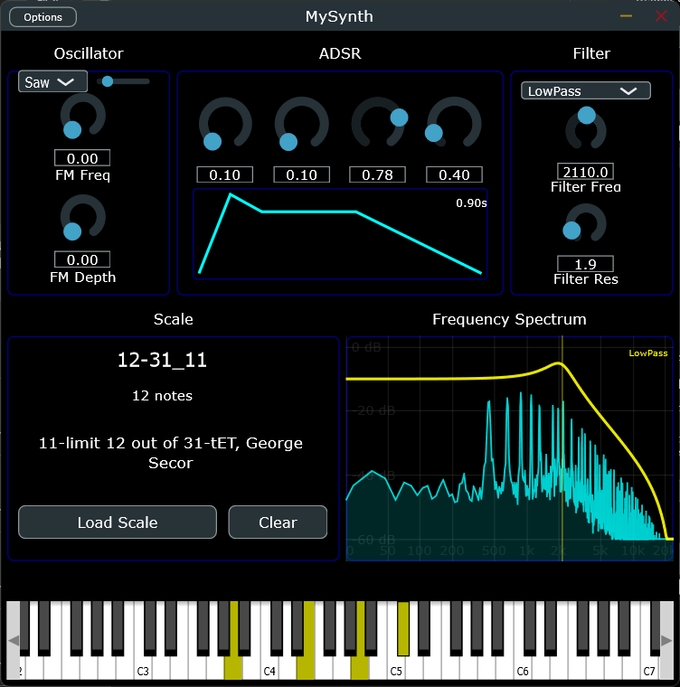

# MySynth

A minimal JUCE-based synthesizer project.

## Overview
MySynth is a small synth application built with the JUCE framework. Intended as a starting point for learning JUCE audio programming and building a simple polyphonic synthesizer.
I added a feature to allow user to import a .scl file and so playing in a different tuning system, with microtonal scales for example.

## Building
#### build :
        >> cmake -B build -G "Visual Studio 16 2019" -A x64
        >> cmake --build build --config Release
#### run (standalone) :
        >> ./build/MySynth_artefacts/Release/Standalone/MySynth.exe

#### Built following these incredible tutorials :
[Let's Build a Synth VST Plug-in with JUCE and C++ (2020)](https://youtube.com/playlist?list=PLLgJJsrdwhPwJimt5vtHtNmu63OucmPck&si=KZlAsZ0AW8tzpErz)

Well, it looks like this :

### Goal
- Clean the code and code duplication
- Clean the UI to make it cleaner and more my type of thing